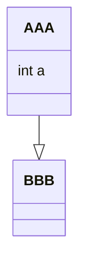
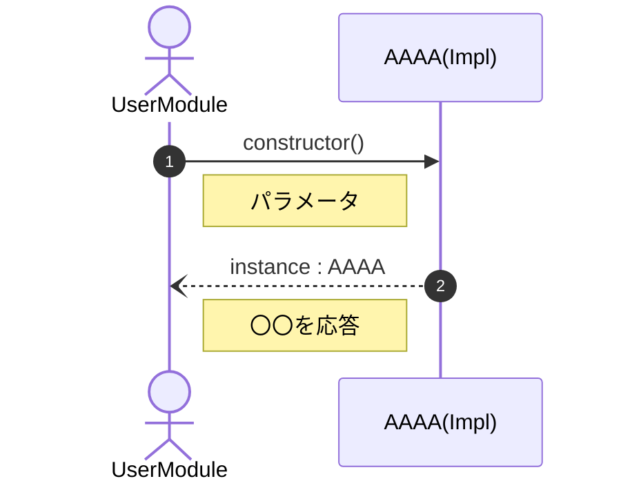

# Rand Specs 

## Summury

WhiteNoise/PerlNoise

## Class Diagram

```mermaid
classDiagram

class AAA {
  int a
}
AAA --|> BBB
```

### Sequence Diagram

プログラムの xxx シーケンス

```mermaid
sequenceDiagram
    autonumber

    actor user as UserModule
    participant AAAA as AAAA(Impl)

    user ->> AAAA: constructor()
    Note left of AAAA: パラメータ


    AAAA --) user : instance : AAAA
    Note left of AAAA: 〇〇を応答
```

