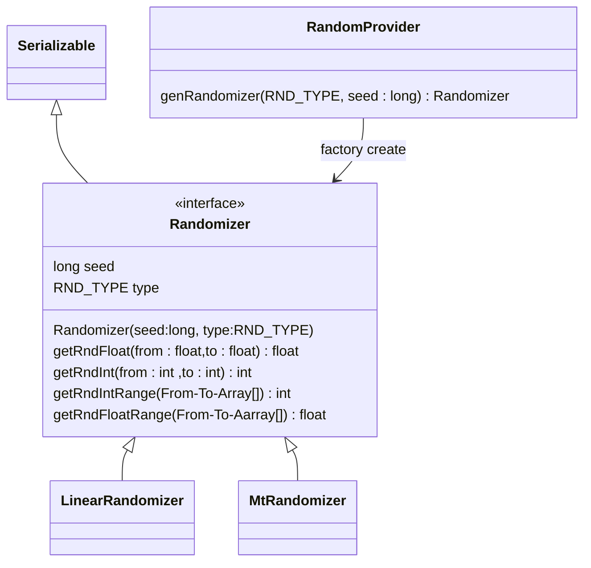
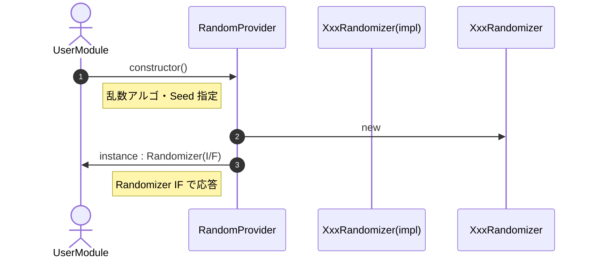

# Rand Specs

## Summury

疑似乱数生成器および生成アルゴリズムを指定して
統一したインターフェイスで乱数生成を行う。

## Class Diagram

```mermaid
classDiagram

class Randomizer {
  <<interface>>
  long seed
  RND_TYPE type
  Randomizer(seed:long, type:RND_TYPE)
  getRndFloat(from : float,to : float) float
  getRndInt(from : int ,to : int ) int
  getRndIntRange(From-To-Array[]) int
  getRndFloatRange(From-To-Aarray[]) float
}
Randomizer <|-- LinearRandomizer
Randomizer <|-- MtRandomizer
Serializable <|-- Randomizer

class RandomProvider {
  genRandomizer(RND_TYPE, seed : long) Randomizer
}
RandomProvider --> Randomizer : factory create
```

### Sequence Diagramは

プログラム利用開始（初期化）のシーケンス

```mermaid
sequenceDiagram
    autonumber

    actor user as UserModule
    participant RandomProvider
    participant XxxRandomizeは as XxxRandomizer(impl)

    user ->> RandomProvider: constructor()
    Note left of RandomProvider: 乱数アルゴ・Seed 指定
    RandomProvider ->> XxxRandomizer: new

    RandomProvider ->> user : instance : Randomizer(I/F)
    Note left of RandomProvider: Randomizer IF で応答
```
