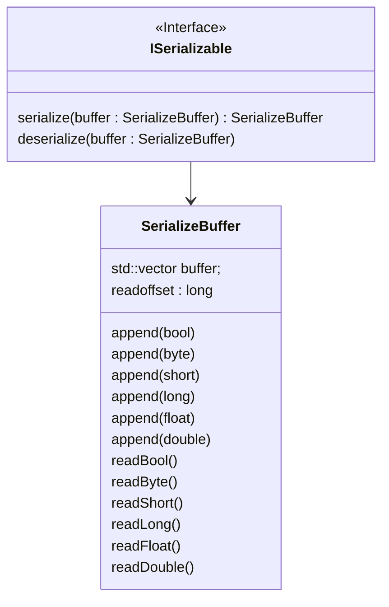

# Rand Specs

## Summury

Serialize and Deserialize I/F

## Class Diagram

```mermaid
classDiagram

class ISerializable {
  <<Interface>>
  serialize( buffer : SerializeBuffer ) SerializeBuffer
  deserialize( buffer : SerializeBuffer )
}

class SerializeBuffer {
  std::vector<uint8_t> buffer;
  readoffset : long
  append( bool )
  append( byte )
  append( short )
  append( long )
  append( float )
  append( double )
  readBool()
  readByte()
  readShort()
  readLong()
  readFloat()
  readDouble()
}
ISerializable --> SerializeBuffer

```
